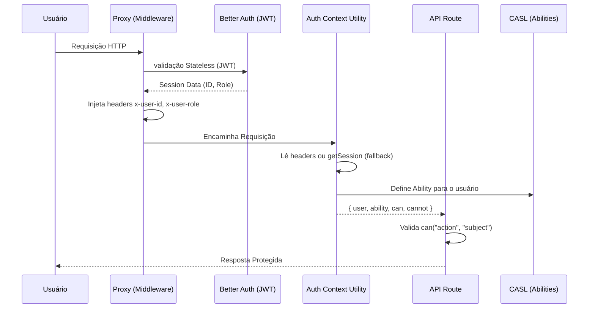

# Arquitetura de Autenticação e Autorização

Este documento descreve a infraestrutura de segurança da plataforma Vigidoc, detalhando o fluxo desde a identificação do usuário até a validação de permissões granulares nas rotas de API.

## Visão Geral

A solução combina **Better Auth** para gerenciamento de identidade, um **Proxy/Middleware** para otimização de performance e **CASL** para controle de acesso baseado em regras (RBAC e ABAC).



---

## 1. Camada de Identidade: Better Auth (IDP)

Utilizamos o **Better Auth** configurado com a estratégia de **JWT Stateless**.

- **Configuração (`lib/auth.ts`)**: `session: { strategy: "jwt" }`.
- **Funcionamento**: Ao contrário da estratégia de banco de dados, o JWT permite que a validação da sessão ocorra inteiramente em memória e CPU, sem custos de Round Trip Time (RTT) para o banco de dados (Supabase/Postgres) em cada requisição.
- **Vantagem**: Redução drástica na latência de autenticação (de >1s para <10ms).

## 2. Otimização de Performance: Proxy Header Sharing

Para evitar múltiplas validações de JWT no ciclo de vida de uma única requisição Next.js, implementamos um padrão de compartilhamento via headers no `proxy.ts`.

1.  **Interpolação**: O `proxy.ts` intercepta a chamada.
2.  **Validação Única**: Ele executa `auth.api.getSession` para validar o token.
3.  **Propagação**: Os dados verificados são injetados nos headers:
    - `x-user-id`: ID único do usuário.
    - `x-user-role`: Role do usuário (admin, user, medic).
4.  **Processamento Downstream**: As rotas subsequentes não precisam re-validar o JWT contra o segredo, apenas ler os headers já "sanitizados" pelo proxy.

## 3. Autorização: CASL (RBAC & ABAC)

A autorização é gerida pelo **CASL**, permitindo uma separação clara entre "quem é o usuário" e "o que ele pode fazer".

### Estrutura de Pastas (`lib/casl/`)
- `abilities.ts`: Define a lógica central de criação de capacidades.
- `permissions.ts`: Onde as regras de negócio residem.
- `subjects/`: Definição dos tipos de objetos (User, Patient, etc).
- `utils/getUserPermission.ts`: Utilitário unificado de contexto.

### RBAC (Role-Based Access Control)
As permissões são atribuídas com base na role:
- **Admin**: Tem permissão `manage all`.
- **User**: Permissões limitadas a si mesmo.

### ABAC (Attribute-Based Access Control)
O CASL permite validar atributos dinâmicos. No arquivo `permissions.ts`, as regras podem incluir condições:
```typescript
user(user, { can }) {
  can("get", "User", { id: user.id }); // Só pode ler se o ID for igual ao dele
}
```

## 4. O Utilitário Unificado: `getAuthContext`

Para simplificar o desenvolvimento e garantir que todos usem o caminho otimizado, centramos tudo no `getAuthContext`.

```typescript
const authContext = await getAuthContext();
const { user, ability, cannot } = authContext;
```

**Responsabilidades do `getAuthContext`:**
1.  **Extração de Identidade**: Tenta ler os headers `x-user-*` (caminho rápido).
2.  **Fallback Seguro**: Se os headers falharem (ex: chamada interna ou teste), ele recorre ao Better Auth.
3.  **Instanciação de Abilities**: Cria a instância do CASL específica para aquele usuário.
4.  **Interface Simplificada**: Expõe `can` e `cannot` diretamente para a rota.

## 5. Exemplo de Uso em Rota de API

Abaixo, como uma rota valida se o usuário tem permissão para listar pacientes:

```typescript
export async function GET(req: Request) {
  const authContext = await getAuthContext();
  if (!authContext) return NextResponse.json({ error: "Unauthorized" }, { status: 401 });

  const { user, cannot } = authContext;

  // Validação CASL (ABAC/RBAC combinados)
  if (cannot("get", "User") && user.role !== "admin") {
      return NextResponse.json({ error: "Forbidden" }, { status: 403 });
  }

  // Lógica de negócio...
}
```

---

## Conclusão para Desenvolvedores e Agentes de IA

- **Não use `auth.api.getSession` diretamente nas rotas**. Sempre prefira `getAuthContext` para aproveitar a otimização de performance.
- **As regras de permissão morrem no `permissions.ts`**. Se precisar adicionar uma nova regra de acesso, mude lá, não na rota.
- **A segurança é em camadas**: O Proxy garante que o usuário existe; o CASL garante que ele tem direito ao dado solicitado.
